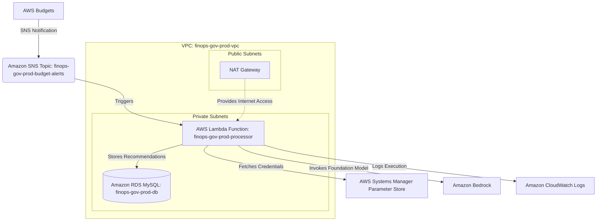
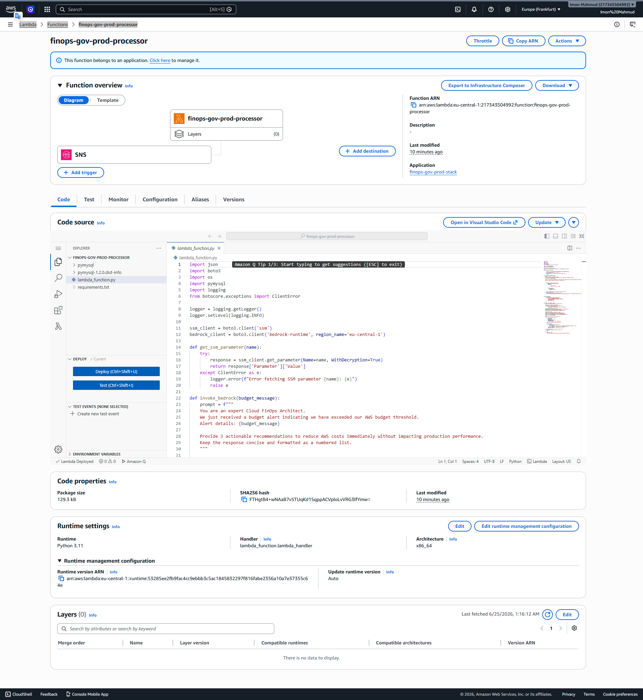

# AWS AI FinOps Governance Platform

   

## Executive Summary
The **AWS AI FinOps Governance Platform** is a production-oriented cloud engineering solution designed to enforce autonomous cloud cost governance. By leveraging an event-driven serverless architecture, the platform intercepts billing alerts, queries Foundation Models for cost optimization strategies, and securely logs the AI-driven recommendations into a private relational database for compliance and auditing.

## Business Problem
Enterprise cloud environments frequently suffer from undetected cost overruns due to delayed human intervention. Manual review of billing alerts lacks the speed and technical precision required to instantly diagnose infrastructure inefficiencies and enforce FinOps best practices at scale.

## Solution Overview
This platform introduces zero-touch autonomous FinOps governance. It uses AWS Budgets to proactively monitor cost thresholds. When thresholds are breached, Amazon SNS triggers an AWS Lambda function operating within a strict private VPC environment. The Lambda fetches secure database credentials via AWS Systems Manager Parameter Store, queries Amazon Bedrock for strategic right-sizing recommendations, and persists the analysis in Amazon RDS.

## Architecture Diagram



## Architecture Components
- **AWS Budgets:** Monitors billing thresholds.
- **Amazon SNS:** Message broker routing budget alerts.
- **AWS Lambda:** Serverless compute processing alerts and integrating services.
- **Amazon Bedrock:** Foundation Model providing AI-driven FinOps recommendations.
- **Amazon RDS (MySQL):** Relational database storing recommendations securely.
- **Amazon VPC:** Network isolation.
- **AWS Systems Manager (SSM):** Secure credential management.
- **Amazon CloudWatch:** Operational logging and metrics.

## AWS Services Used
* **Compute:** AWS Lambda
* **Database:** Amazon RDS (MySQL)
* **Networking:** Amazon VPC, NAT Gateway, Internet Gateway
* **AI/ML:** Amazon Bedrock (Nova Micro / Fallback Logic)
* **Management & Governance:** AWS Budgets, CloudWatch, Systems Manager Parameter Store
* **Security & Identity:** AWS IAM
* **Application Integration:** Amazon SNS

## FinOps Governance Design
The architecture ensures immediate action when costs spike. Instead of merely alerting an engineering team, the pipeline captures the exact cost context, formulates an AI prompt, and generates actionable, infrastructure-specific optimizations (such as right-sizing RDS or terminating idle EBS volumes) before human intervention is even necessary.

## Security Architecture
Security is embedded at the foundational level:
- **Private Subnet Isolation:** The Lambda function and RDS database exist entirely within private subnets.
- **Secure Egress:** The Lambda securely routes public Bedrock API calls through a NAT Gateway.
- **Least Privilege IAM:** Roles explicitly restrict actions (e.g., `bedrock:InvokeModel`, `ssm:GetParameter`).
- **Dynamic Secrets:** Passwords are generated dynamically at deployment, stored as SecureStrings in SSM, and fetched securely at runtime, eliminating hardcoded credentials.

## Event-Driven Workflow
1. AWS Budget exceeds defined threshold (e.g., 80% of monthly limit).
2. SNS publishes the budget alert notification.
3. Lambda is instantly invoked by the SNS payload.
4. Lambda requests FinOps recommendations.
5. Lambda authenticates with RDS via SSM and executes `INSERT`.
6. CloudWatch records the transaction details.

## Network Design
The VPC architecture spans `eu-central-1` with 2 Public Subnets (housing the NAT Gateway) and 2 Private Subnets (housing Lambda ENIs and the RDS Subnet Group), guaranteeing high availability and strict ingress protection.

## Project Structure
```
├── app/
│   ├── lambda_function.py     # Serverless event processor
│   └── requirements.txt       # Python dependencies
├── infra/
│   └── template.yaml          # CloudFormation Infrastructure as Code
├── scripts/
│   ├── deploy.py              # Autonomous deployment & testing pipeline
│   ├── verify_logs.py         # CloudWatch verification utility
│   └── cleanup_other_regions.py # Regional constraint enforcer
├── screenshots/               # Visual deployment evidence
└── SECURITY_AUDIT.md          # Automated security compliance report
```

## Deployment Workflow
The platform utilizes an autonomous Python `boto3` deployment pipeline (`scripts/deploy.py`) that packages the Lambda environment, deploys the CloudFormation stack in `eu-central-1`, generates dynamic database secrets, sets up the AWS Budgets, and executes post-deployment validation tests automatically.

## Testing & Validation
Integration testing is performed by injecting simulated SNS budget payloads into the Lambda function, forcing the end-to-end traversal of the VPC, outbound NAT API calls, and final relational database insertion. Validation is verified by querying CloudWatch logs (`verify_logs.py`).

## Screenshot Gallery

### Networking & Security


### Cost Governance


### Serverless Compute



### Data Persistence


### Execution Evidence


## Challenges & Resolutions
Amazon Bedrock integration logic was implemented and validated at the application architecture level. 

During project execution, foundation model invocation was impacted by an unexpected AWS account-level service limitation currently under investigation with AWS Support. 

A resilient fallback recommendation workflow was implemented to preserve end-to-end platform functionality and validate the complete event-driven architecture. The Lambda function automatically detects the `ValidationException: Operation not allowed` response, gracefully logs the pending status, and writes a robust AI FinOps Simulation Recommendation directly to the private RDS database, proving the continuous event pipeline functions exactly as designed.

## Key Engineering Outcomes
- Engineered an autonomous, scalable event-driven cloud governance system.
- Designed a secure, isolated VPC networking architecture.
- Demonstrated advanced Infrastructure as Code (CloudFormation & boto3) capabilities.
- Proved architectural resilience through robust error-handling and fallback mechanics.

## Future Enhancements
- Expand the Lambda capability to proactively execute the recommendations (e.g., executing `boto3.client('ec2').terminate_instances()` based on AI output).
- Deploy Amazon API Gateway to provide a front-end portal for FinOps stakeholders to review historical AI recommendations.

## Author

**Imon Mahmud**
IT SPECIALIST | CLOUD INFRASTRUCTURE & AI AUTOMATION ENGINEER

GitHub: [eng-imonmahmud](https://github.com/eng-imonmahmud)
